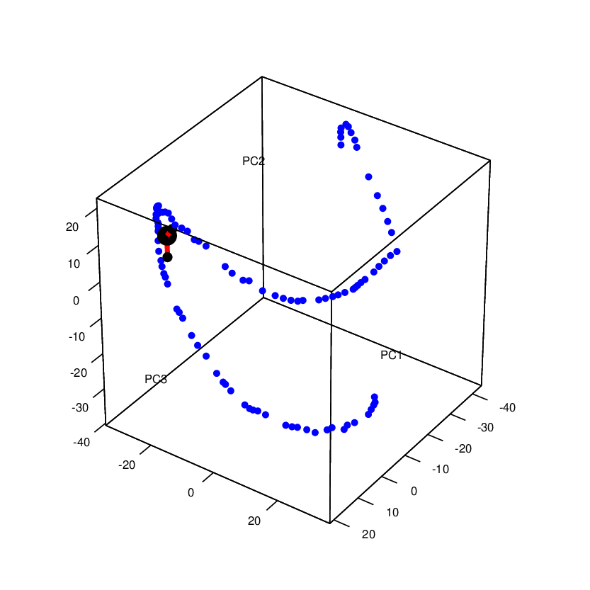

# ElPiVideo
Application of Elpigraph with pseudotime ordering on a video

<<<<<<< HEAD

To fully run the code, the following packages are needed:

-	ffmpeg
-	ImageMagick

and the follwing R packages:

-	ElPiGraph.R
-	jpeg
- stringr
- rgl
- irlba
=======
>>>>>>> b65d059879ad268a5193de7fed2b03cf57294786

video taken from the following url:
https://videos.pexels.com/videos/black-and-white-footage-of-train-station-853874

